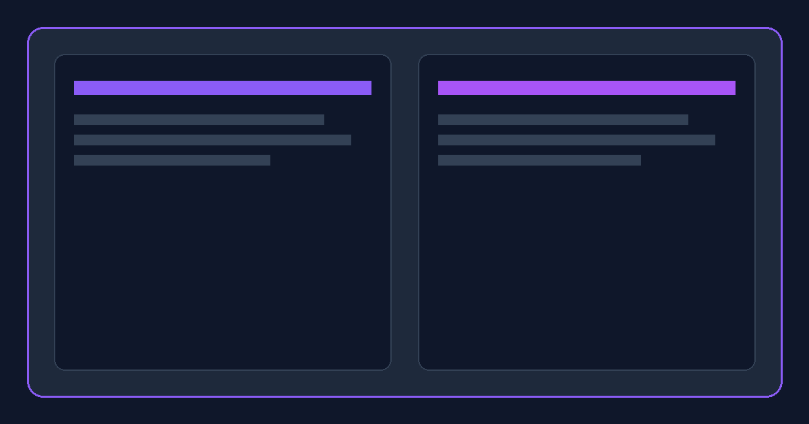

# Caesar Cipher Encryption & Cryptanalysis Studio 🔒⚡


A complete, production-ready, portfolio-worthy web application for encrypting, decrypting, visualizing, brute-force cracking, and analyzing Caesar substitution ciphers. Built with 100% pure **HTML5**, **CSS3 (Vanilla)**, and **ES6+ JavaScript**.

---

## 🌟 Visual Preview



---

## 🚀 Main Features

### 🔐 1. Cipher Studio Workspace
- **Real-Time Live Encryption**: Auto-updates ciphertext as you type.
- **Encrypt & Decrypt Modes**: Toggle seamlessly with instant UI feedback.
- **Synchronized Shift Controls**: Interactive range slider (1–25) and numerical input stayed in sync.
- **Preset & Randomizer**: Quick shifts (Caesar Shift 3, ROT13 Shift 13) plus 🎲 Random Shift generator.
- **ASCII & Character Preservation**: Uppercase, lowercase, numbers, symbols, spaces, and multiline breaks are preserved.

### 🎡 2. Animated Alphabet Wheel & Step Explorer
- **Interactive Dual-Ring SVG Wheel**: Animates shift rotations visually in real time.
- **Step-by-Step Character Inspector**: Inspects each character using modular arithmetic:
  $$\text{Encryption: } E_k(x) = (x + k) \bmod 26$$
  $$\text{Decryption: } D_k(x) = (x - k) \bmod 26$$

### ⚡ 3. Cryptanalysis & Auto-Crack Tools
- **Brute-Force Scanner**: Evaluates all 25 shift variations simultaneously and ranks candidates by English letter frequency likelihood score.
- **Frequency Analysis Chart**: Visual bar chart comparing message letter frequencies against standard English letter frequencies (`ETAOIN SHRDLU`).

### 📜 4. History & Favorites Manager
- **Operation History**: Persists up to 10+ operations with timestamps, operation tags, and search filters.
- **Favorites & Reuse**: Star favorite snippets and load them back into the workspace with a single click.
- **Export & Import**: Save and restore history using JSON format.

### 🎨 5. Multi-Theme System & Customization
- 🌙 **Slate Dark (Default)**
- ☀️ **Light Modern**
- ⚡ **Cyberpunk Neon**
- 💻 **Matrix Hacker**
- 🔮 **Obsidian Glass**
- 🔊 **Synthesized Web Audio SFX**: Real-time sound effects synthesized using Web Audio API (zero external mp3 assets).
- ⌨️ **Keyboard Shortcuts Modal**: Quick hotkeys (`Ctrl+Enter`, `Ctrl+Shift+C`, `Ctrl+Shift+R`, `Ctrl+Shift+M`).

---

## 📂 Folder Structure

```
Caesar-Cipher-Encryption-Tool/
│
├── index.html          # Accessible, semantic HTML5 markup
├── style.css           # Modern CSS3 design system with CSS custom properties & Glassmorphism
├── script.js           # Modular ES6+ JavaScript core engine & visualizations
├── README.md           # Comprehensive documentation & technical guide
├── LICENSE             # Open source MIT License
│
└── assets/
       ├── preview.png  # Portfolio preview banner (1200x630)
       ├── logo.png     # Application branding icon (256x256)
       └── favicon.ico  # Browser tab favicon (64x64)
```

---

## 💻 Tech Stack

- **Core Architecture**: HTML5 Semantic Elements & ARIA accessibility attributes.
- **Styling**: Vanilla CSS3 using CSS Custom Properties (Variables), Flexbox, CSS Grid, Glassmorphism backdrop filters, and CSS keyframe animations.
- **Logic & Math Engine**: Pure ES6+ JavaScript (Web Audio API, FileReader API, LocalStorage, SVG manipulation).
- **Dependencies**: 0 External Libraries or Frameworks.

---

## 📖 How the Caesar Cipher Works

The **Caesar Cipher** is a classic substitution cipher where each letter in the plaintext is shifted down the alphabet by a fixed number $k$:

1. Assign numbers to each letter: $A = 0, B = 1, \dots, Z = 25$.
2. For an input character code $x$ and shift key $k$:
   - **Encryption Formula**:
     $$E_k(x) = (x + k) \bmod 26$$
   - **Decryption Formula**:
     $$D_k(x) = (x - k) \bmod 26$$

### Example (Shift $k = 3$):
- Plaintext: `H E L L O`
- Shift: $+3$
- Ciphertext: `K H O O R`

---

## 🛠️ Installation & Setup

1. **Clone the repository**:
   ```bash
   git clone https://github.com/kathir-01/Caesar-Cipher-Encryption-Tool.git
   ```
2. **Navigate into the folder**:
   ```bash
   cd Caesar-Cipher-Encryption-Tool
   ```
3. **Open `index.html` in any web browser**:
   No build steps, node servers, or npm installs required!

---

## 🔑 Keyboard Shortcuts

| Hotkey | Action |
| :--- | :--- |
| <kbd>Ctrl</kbd> + <kbd>Enter</kbd> | Execute Encrypt / Decrypt |
| <kbd>Ctrl</kbd> + <kbd>Shift</kbd> + <kbd>C</kbd> | Copy Output Text |
| <kbd>Ctrl</kbd> + <kbd>Shift</kbd> + <kbd>R</kbd> | Generate Random Shift |
| <kbd>Ctrl</kbd> + <kbd>Shift</kbd> + <kbd>M</kbd> | Swap Operation Mode |
| <kbd>Esc</kbd> | Close Modal |

---

## 🔮 Future Improvements (V2 Roadmap Architecture)

- [ ] Vigenère & Polyalphabetic Cipher extension
- [ ] PWA (Progressive Web App) offline service worker
- [ ] QR Code Generator for encrypted payload sharing
- [ ] Multi-language localization (i18n)

---

## 📜 License

Distributed under the **MIT License**. See `LICENSE` for more information.

---

## 👤 Author

Crafted with excellence for GitHub Portfolio, Resume Showcase, and College Demonstrations.
